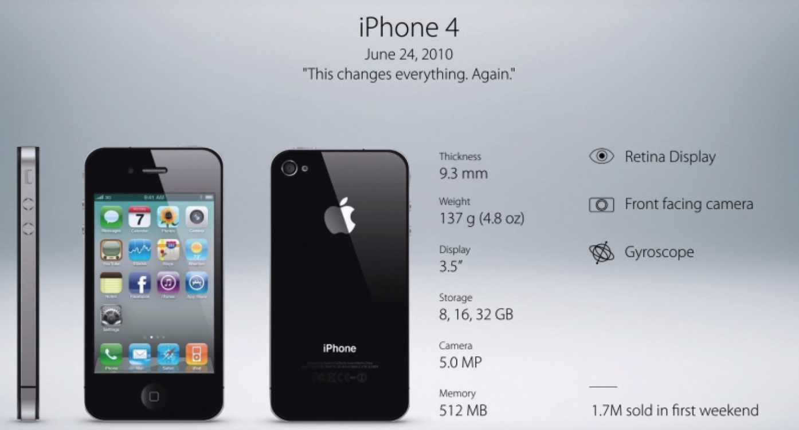

When Apple launched the first iPhone in 2007, it revolutionized the tech world. From the App Store to touchscreens, each new model brought increased functionality, innovative user interfaces, and significant upgrades in performance which left competition in the dust. Fast forward to the iPhone X in 2017, which introduced Face ID and the edge-to-edge OLED display, and it seemed like Apple was still leading the charge. 

But since then, newer models have focused increasingly on incremental improvements with camera systems, battery life and material composition. Features like "aerospace-grade titanium" and USB-C in just last year's model either lack any meaningful innovation, or are simply years behind industry standard.

A clear trend in Apple's approach is the trickling down of Pro-line innovations to their regular iPhones. Features previously reserved for higher-end models, like OLED display and the dynamic island, eventually made their way into the non-Pro versions, increasing a general sense of dwindling innovation. On the other hand, competitors seem to be looking to the future, with virtually bezel-less displays, AI enhanced cameras and foldable displays (now tri-foldable - see the Huawei Mate XT below), which may see Apple take decades to implement - if they ever do. 

As we look ahead, it’s unclear if Apple will rekindle the groundbreaking spirit that made the iPhone iconic or if we’ve entered an era where steady, incremental updates become the norm. Either way, am I still going to buy iPhones? Yes. I type this as if I don't have the entire Apple ecosystem sitting in front of me.

My one burning question is: When will Apple change the naming of their phones? Will we live to see the release of the iPhone 100? Or will Apple change to Roman numerals, or a completely different naming scheme? Send your guesses below...