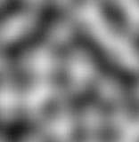

## What you'll be making!


## What is p5js?
p5. js is a JavaScript library for creative coding. A collection of pre-written code, it provides us with tools that simplify the process of creating interactive visuals with code in the web browser.

## Setting up
The easiest way to program p5js is using the [online editor](https://editor.p5js.org/). If you want to use it locally, checkout [p5js reference](https://p5js.org/download/).

## How do vector flow fields work?
A vector is a **direction** coupled with a **magnitude**. A vector flow field uses a grid of these vectors, with particles following the vectors as they move.

We will do this using Perlin noise to generate our vector grid.

> Perlin noise is a procedural texture primitive, a type of gradient noise used by visual effects artists to increase the appearance of realism in computer graphics. The function has a pseudo-random appearance, yet all of its visual details are the same size.

And looks a bit like the this:


## Coding in p5js
Fortunately, p5js has a `noise` library to help us with setting this up! Here's how we set our grid of vectors up:
```js
function setupZeroGrid() {
  return Array(VW).fill().map(() => Array(VH).fill(0));
}

function setupNoiseGrid() {
  noiseDetail(8, 0.65);
  let grid = setupZeroGrid();
  for (let x = 0; x < VW; x++) {
    for (let y = 0; y < VH; y++) {
      grid[x][y] = noise(x/500, y/500);
    }
  }
  return grid;
}

function setupDirectionGrid(directionGrid) {
  for (let x = 0; x < VW; x++) {
    for (let y = 0; y < VH; y++) {
      directionGrid[x][y] = directionGrid[x][y] * 2 * PI;
      directionGrid[x][y] = createVector(cos(directionGrid[x][y]), sin(directionGrid[x][y])); 
    }
  }
  return directionGrid;
}
```

The `setupZeroGrid` functions simply creates our grid, and the `setupNoiseGrid` function fills in our grid with perlin noise values which represent our **direction**. Finally, the `setupDirectionGrid` function converts our grid of numbers into a grid of vectors.

We also have the particles that render onto our screen. These will also be modelled by an array of vectors that represent their location.
```js
function setupParticles() {
  for (let i = 0; i < NUM_PARTICLES; i++) {
    particles.push(createVector(random(0, VW), random(0, VH)));
  }
}
```
Using p5js's `random` function, we make each particles start with a random location.

Now that we're all setup, we have to define what we do in each frame. This is done using our `stepParticles` function
```js
function stepParticles() {
  for (let i = 0; i < NUM_PARTICLES; i++) {
    strokeWeight(2);
    let oldLocation = createVector(particles[i].x, particles[i].y);
    let dGridx = directionGrid[floor(oldLocation.x)][floor(oldLocation.y)].x;
    let dGridy = directionGrid[floor(oldLocation.x)][floor(oldLocation.y)].y;
    let newLocation = createVector(oldLocation.x + SPEED * dGridx + 0.5 + random(-RANDOM, RANDOM), oldLocation.y + SPEED * dGridy + random(-RANDOM, RANDOM));
    stroke(abs(dGridx) * 255, abs(dGridy) * 255, (abs(dGridx)+abs(dGridy)) * 150, 100);
    if (!inRange(newLocation)) {
      newLocation.x = positiveMod(newLocation.x, VW);
      newLocation.y = positiveMod(newLocation.y, VH);
      particles[i].x = newLocation.x;
      particles[i].y = newLocation.y;
      continue;
    }
    line(oldLocation.x, oldLocation.y, newLocation.x, newLocation.y);
    particles[i].x = newLocation.x;
    particles[i].y = newLocation.y;
  }
}
```

Now, this looks complicated; but really all we are doing is moving each particle forward based on the vector on which it lies, and then adding a small random adjustment to the particles position. Without the random, we'd just have one long line.

And that's about it. Now we have all the logic, lets just add it to the `setup` and `draw` functions. `setup` is called by p5js at the beginning, `draw` is called once per frame:
```js
function setup() {
  // CONSTANTS
  VW = windowWidth;
  VH = windowHeight;
  BACK_COLOUR = color(3, 3, 1);
  GRID_COLOUR = color(100);
  NUM_PARTICLES = 5000;
  SPEED = 5;

  // THE ACTUALLY IMPORTANT VARIABLES
  directionGrid = setupNoiseGrid();
  directionGrid = setupDirectionGrid(directionGrid);
  particles = [];
  ticker = 0;
  setupParticles();

  // SETTING UP THE CANVAS
  frameRate(60);
  createCanvas(VW, VH);
  background(3, 3, 1);
}

function draw() {
  RANDOM = slider2.value();
  SPEED = slider1.value();
  background(3, 3, 1, decay);
  stepParticles();
}
```

Thanks for reading :). To have a look at the full implementation, see [my github](https://github.com/VinayakFia/JavaScript-Projects-With-p5.js/blob/main/Vector_Flow_Field/sketch.js).
