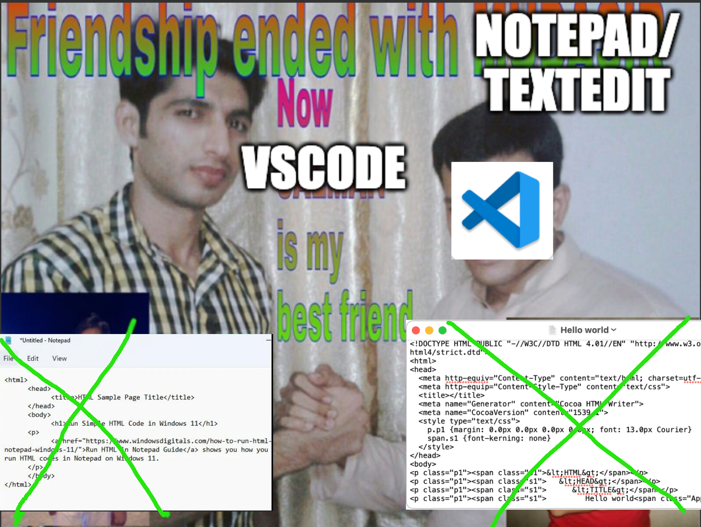
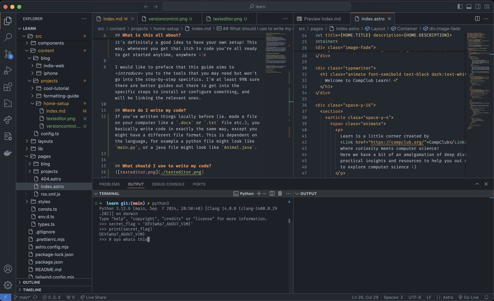
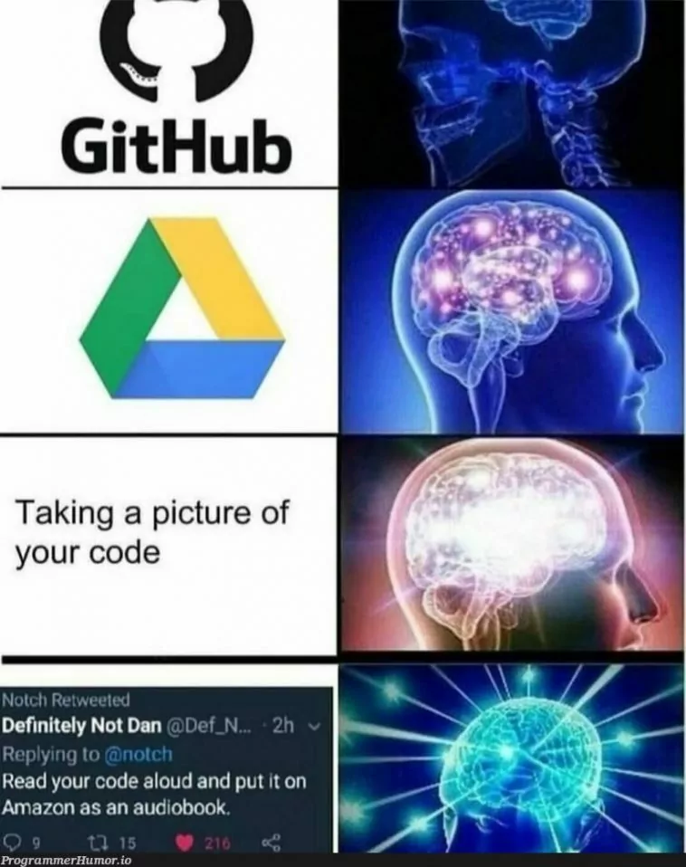

## What is this all about?
If you've ever wanted to take the plunge into programming, or have programmed before; albeit on pre-setup environment (maybe during our workshops? 👀), it's definitely a good idea to have your own setup! This way, whenever you get that itch to code you're all ready to get started anytime, anywhere :)c

I would like to preface that this guide aims to *introduce* you to the tools that you may need but won't go into the step-by-step specifics. I'm at least 99% sure there are better guides out there to get into the specific steps to install or configure something, and will be linking the relevant ones.

## Where do I write my code?
If you've written things locally before (ie. made a file on your computer like a `.docx` or `.txt` file etc.), you basically write code in exactly the same way, except you might have a different file format. This is dependent on the language, for example a python file might look like `main.py`, or a java file might look like `Animal.java`. But otherwise, it literally just is a file with text on it.

Navigating through your files and directories (aka folders) can become quite tedious and slow, i'd also recommend trying to familliarise yourself with [navingating in your terminal](https://developer.mozilla.org/en-US/docs/Learn/Tools_and_testing/Understanding_client-side_tools/Command_line), since you will be using it quite alot when you code!

## What should I use to write my code?

While yes, you technically *could* write your code on something like [notepad](https://apps.microsoft.com/detail/9msmlrh6lzf3?hl=en-US&gl=US) (if you use windows) or [textedit](https://support.apple.com/en-au/guide/textedit/welcome/mac) (if you're on mac), there are some much more powerful editors you can use to make your life easier.

One of the most popular editors is [VSCode](https://code.visualstudio.com/) (Visual Studio Code)! It's the one we teach you how to use in our workshops, and is usually the one that different courses recommend using at UNSW!

Some really nice features that you might find useful (but are not limited to) would be a concise view of your file tree, split-screen or multi tab view, and syntax highlighting. Of course, there are many more handy features but we'd be here all day if I listed them. It's also really simple to customise with different extensions and themes!

## How do I run my code?
This is a tricky one, because actually it depends on what language you're using! While some languages such as python, C and bash might be built into your system, others need to be installed; similar to how you might download an app.

- [Node js](https://nodejs.org/en) for javascript
- [rustup](https://www.rust-lang.org/tools/install) for rust
- [stack](https://docs.haskellstack.org/en/stable/#__tabbed_2_1) for haskell

Some other tools or languages might be a little harder to install, requiring multiple steps and downloads. I'd recommend installing a [package manager](https://en.wikipedia.org/wiki/Package_manager#:~:text=A%20package%20manager%20or%20package,example%20of%20a%20package%20manager) for cases like this! (windows has one built in i think, but for mac users i'd recommend using [homebrew](https://brew.sh/))
This way, instead of going through several windows of installation instructions and dragging a million things into different folders, you can just copy a command into your terminal to install something.

Note that some languages may need you to **compile** the code before being able to run it, but some toolchains might help you with that step before running your code! 

## Can I code collaboratively?
From managing multiple versions of your code (in the case you realise you made a mistake somewhere down the line and would want to revert), to being able to work on code simultaneously with others, [github](https://github.com/) can do it all!

Git is by far the most popular version control system used by programmers (by like 98% or some crazy number) for a good reason, it lets you track any historical changes to your files (and traverse back and forth between versions), as well as manage multiple different timelines of your work!

Github lets you do that **and** work with others on the same project without the worry of stepping on each other's toes. It takes a bit of set up and a bit of learning to get used to, but it is absolutely worth it!